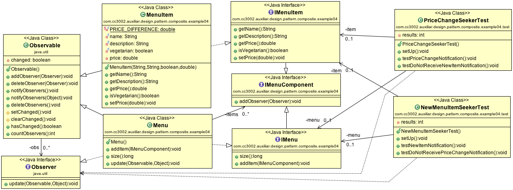
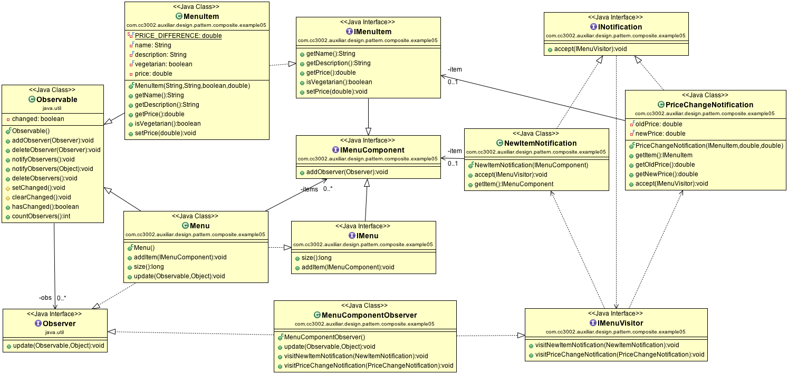

# Composite and Observer Pattern

## Used Design Patterns

- [Wikipedia: Composite pattern](https://en.wikipedia.org/wiki/Composite_pattern)
- [Wikipedia: Observer pattern](https://en.wikipedia.org/wiki/Observer_pattern)
- [Wikipedia: Visitor pattern](https://en.wikipedia.org/wiki/Visitor_pattern)

## Restaurant Menu 

Let's say that we have a restaurant menu that is composed of plates (menu items). Each plate has a name, description, and price. The implementation could be like following:

[Source code](../src/main/java/com/cc3002/auxiliar/design/pattern/composite/example01).

## Structured Restaurant Menu (Composite Pattern)

Now, you want to implement a menu, that is composed of different sub-menus, e.g., vegetarian menu, vegan menu, hindu menu, or chilean menu. The solution could be the following: 

[Source code](../src/main/java/com/cc3002/auxiliar/design/pattern/composite/example02).

## Price Changes Observer (Java Observer Pattern)

Now, you want to be informed about price changes of a menu. We can use `Observer` interface and `Observable` class that are parts of Java library:

[Source code](../src/main/java/com/cc3002/auxiliar/design/pattern/composite/example03).

## New Menu Observer (Java Observer Pattern)

Well, and moreover, you want to be informed about new menu items. Using the existing solution, we can end up with the following solution: 

[Source code](../src/main/java/com/cc3002/auxiliar/design/pattern/composite/example04).

To see, how it works, check `PriceChangeSeekerTest` and `NewMenuItemSeekerTest` test classes.

But the disadvantage is that even persons who are interested only in price changes, will be informed about new items. And there is no way to know, if he or she receives notification because of a price change or because of a new item. 

## Notifications (Observer plus Visitor Pattern)

In order to know what notification we receive, we could reuse the second parameter of the `update` method. Here we can put an object, a notification object, that has the information we need. Then, we use the double dispatch (Visitor pattern) that helps us to call the right method.

[Source code](../src/main/java/com/cc3002/auxiliar/design/pattern/composite/example05).

The `MenuComponentObserver` does anything in the `visit*` methods and those who are interested in price change or new item notification, will subclass the observer and rewrite corresponding methods.

To see, how it works, check `PriceChangeSeekerTest` and `NewMenuItemSeekerTest` test classes.

## Customized Observer Pattern

Another solution could be using our customized observer pattern and handle notification sending by ourselves. Then our observer `IMenuComponentObserver` implements two methods that are called whenever the corresponding change occurs. 

[Source code](../src/main/java/com/cc3002/auxiliar/design/pattern/composite/example06).

To see, how it works, check `PriceChangeSeekerTest` and `NewMenuItemSeekerTest` test classes.

## JavaFX Events

The first solution with notification objects is a promising idea, but we still receive all notification in one method called `update`. Then we use double-dispatch in order to find out what we receive. 

The second solution with customized observer is also promising idea. We have different methods for different events. And it is likely less confusing then the first solution. 

Fortunately we can combine those two solutions. And the solution already exists in JavaFX library. 

[Source code](../src/main/java/com/cc3002/auxiliar/design/pattern/composite/example07).

To see, how it works, check `PriceChangeSeekerTest` and `NewMenuItemSeekerTest` test classes.
