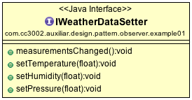
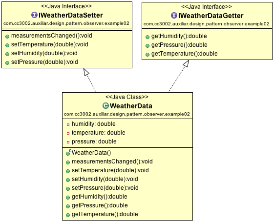
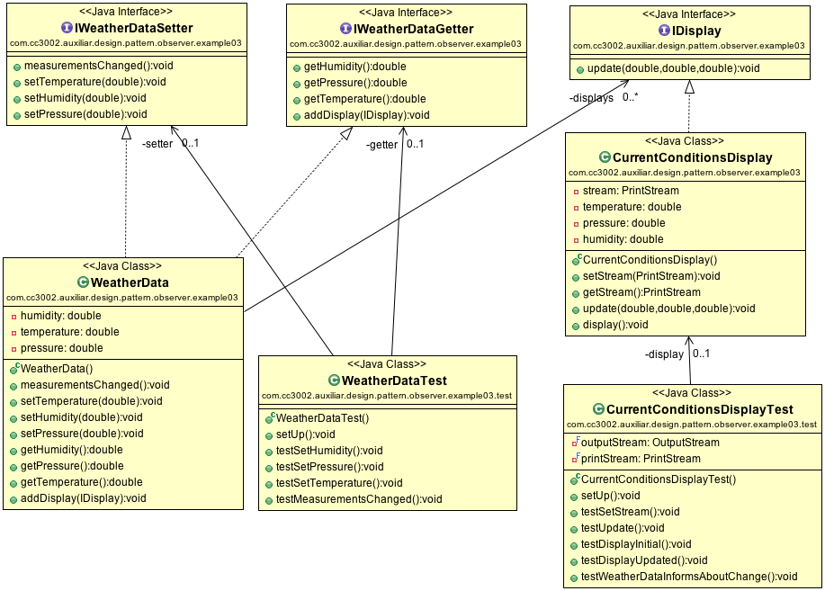
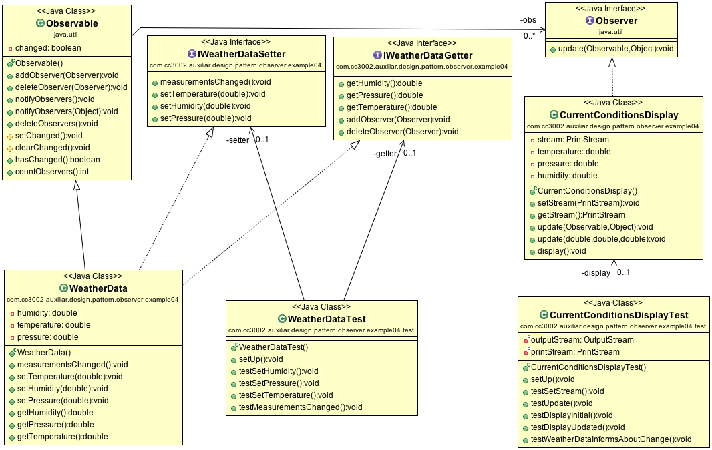

# Observer Pattern

## Introduction 

Let's say that we have sensors that response us temperature, pressure, and humidity. We can communicate with the sensor using `IWeatherDataSetter` interface.

The values are set using setters and `measurementsChanged` is executed whenever values are changed. [Source code](../src/main/java/com/cc3002/auxiliar/design/pattern/observer/example01).

## Current Weather Conditions

Now, you want to implement a simple weather station that shows the current conditions. First, you need a real object (class), that implements the `IWeatherDataSetter` interface, let's call it `WeatherData`. Second, a station that displays current weather conditions, let's call it `CurrentConditionsDisplay`. The solution could be the following: 

[Source code](../src/main/java/com/cc3002/auxiliar/design/pattern/observer/example02).

## Customized Observer Pattern

How does `WeatherData` should inform `CurrentConditionsDisplay` about changes? 

[Source code](../src/main/java/com/cc3002/auxiliar/design/pattern/observer/example03).

## Java Observer Pattern

[Source code](../src/main/java/com/cc3002/auxiliar/design/pattern/observer/example04).
