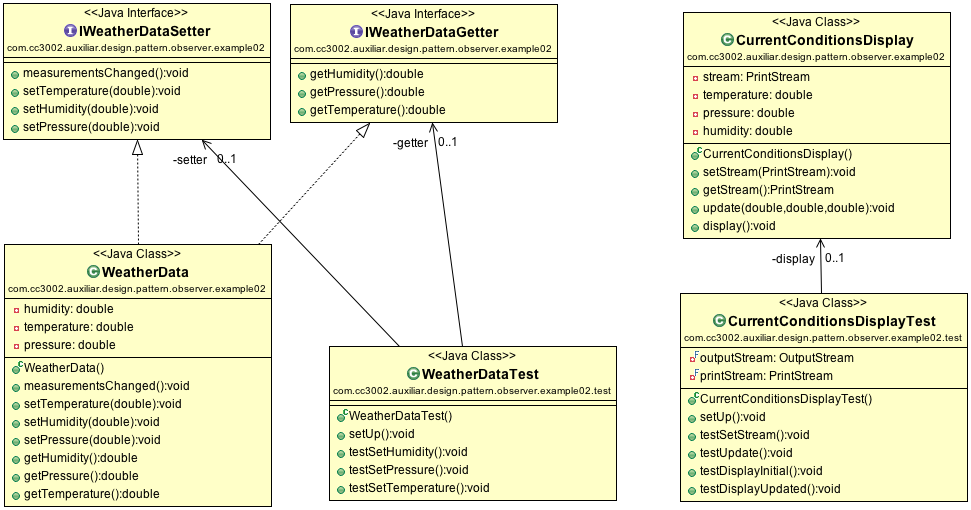

# Observer Pattern

## Introduction 

Let's say that we have sensors that response us temperature, pressure, and humidity. We can communicate with the sensor using `IWeatherDataSetter` interface.

The values are set using the setters and `measurementsChanged` is executed whenever values are changed. [Source code](../src/main/java/com/cc3002/auxiliar/design/pattern/observer/example01).

## Current Weather Conditions Display

Now, you want to implement a simple weather station that shows the current conditions. You need:

1. a real object (class), that implements the `IWeatherDataSetter` interface, let's call it `WeatherData`; 
2. a station that displays current weather conditions, let's call it `CurrentConditionsDisplay`. 

The solution could be the following: 

[Source code](../src/main/java/com/cc3002/auxiliar/design/pattern/observer/example02).

## Customized Observer Pattern

How does `WeatherData` should inform `CurrentConditionsDisplay` about changes? Let's add to `WeatherData` a list of `IDisplay` objects and call `update` method whenever there is a change.

[Source code](../src/main/java/com/cc3002/auxiliar/design/pattern/observer/example03).

## Java Observer Pattern

Well, you have just implemented an observer pattern. Java already has an interface `Observer` (similar to `IDisplay`) and `Observable` (similar to the list of `IDisplay` objects that you have added to `WeatherData`).

[Source code](../src/main/java/com/cc3002/auxiliar/design/pattern/observer/example04).
